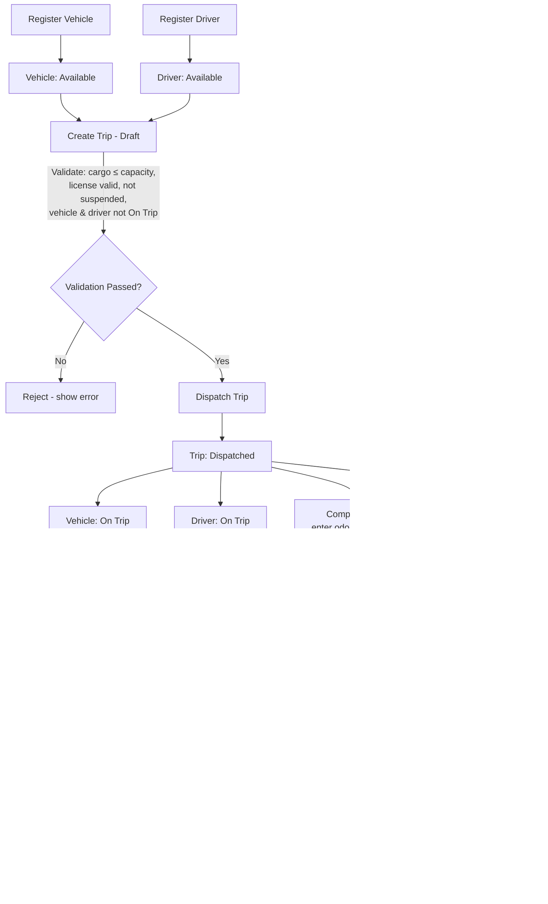

# TransitOps

**Smart Transport Operations Platform** — an end-to-end fleet, driver, dispatch, maintenance, and
expense management system, built for a time-boxed hackathon.

Logistics teams that still run on spreadsheets and paper logbooks deal with scheduling conflicts,
underused vehicles, missed maintenance, expired licenses, and no real visibility into cost or
utilization. TransitOps digitizes the full lifecycle — from vehicle registration to dispatch,
maintenance, fuel logging, and analytics — with business rules enforced at the database level so
they can't be bypassed.

---

## Table of Contents

- [Features](#features)
- [Tech Stack](#tech-stack)
- [Architecture](#architecture)
- [Flow Diagram](#flow-diagram)
- [Quick Start](#quick-start)
- [Roles & Permissions](#roles--permissions)
- [Business Rules](#business-rules)
- [Project Structure](#project-structure)
- [Getting Started](#getting-started)
- [Environment Variables](#environment-variables)
- [Database Setup (Neon)](#database-setup-neon)
- [Running Tests](#running-tests)
- [Demo Script](#demo-script)
- [Scripts Reference](#scripts-reference)
- [Roadmap / Out of Scope](#roadmap--out-of-scope)
- [Docs](#docs)

---

## Features

- 🔐 **Authentication + RBAC** — email/password login, four distinct roles with route-level access control
- 🚚 **Vehicle Registry** — full CRUD with unique registration numbers and lifecycle status
- 🧑‍✈️ **Driver Management** — license tracking, expiry validation, safety scores
- 🗺️ **Trip Management** — Draft → Dispatched → Completed/Cancelled lifecycle with automatic validation (capacity checks, no double-booking, expired-license blocking)
- 🔧 **Maintenance Workflow** — opening a maintenance record automatically pulls a vehicle out of the dispatch pool
- ⛽ **Fuel & Expense Tracking** — per-vehicle logs with automatic operational cost roll-up
- 📊 **Dashboard & KPIs** — Active Vehicles, Available Vehicles, Fleet Utilization %, Active/Pending Trips, Drivers On Duty
- 📈 **Reports & Analytics** — Fuel Efficiency, Operational Cost, Vehicle ROI, CSV export
- ✅ **DB-enforced business rules** — critical status transitions run as Postgres triggers, not just app code, so they hold regardless of which client calls the API

---

## Tech Stack

| Layer | Choice |
|---|---|
| Frontend | React (Next.js App Router) + TypeScript |
| Styling | Tailwind CSS + shadcn/ui |
| Charts | Recharts |
| Forms/Validation | React Hook Form + Zod |
| Backend | Next.js API routes / server actions |
| ORM | Prisma |
| Database | Neon (serverless Postgres) |
| Auth | Session-based auth + custom RBAC middleware |
| Testing | Vitest (unit, integration), Neon branch as isolated test DB |
| Hosting | Vercel (frontend + API), Neon (DB) |

---

## Architecture

```
┌─────────────────┐      ┌──────────────────────┐      ┌───────────────────┐
│   React (Next.js)│ ───▶ │  API Routes / Server │ ───▶ │   Neon (Postgres)  │
│   Tailwind + UI  │ ◀─── │  Actions + RBAC       │ ◀─── │   via Prisma ORM   │
└─────────────────┘      │  middleware           │      │  + SQL triggers    │
                          └──────────────────────┘      └───────────────────┘
```

- **UI layer** never talks to the DB directly — everything goes through API routes.
- **RBAC** is enforced in middleware on every route (`session.role` checked against an allowed-roles map per endpoint).
- **Critical status transitions** (dispatch, complete, cancel, maintenance open/close) are enforced via Postgres trigger functions as a safety net beneath the app-layer logic — see `docs/SCHEMA.md`.

---

## Flow Diagram

End-to-end operational flow, from registration through dispatch, completion, and maintenance —
this mirrors the business rules in `docs/SPEC.md`.



**Reading the diagram:**
- The **left branch** (Vehicle/Driver registration → Available) feeds trip creation.
- **Validation** (rules R1–R6, R13) happens before a trip can be dispatched — this is where most of the business logic lives.
- **Dispatch → Complete/Cancel** is the core state machine (rules R7–R10), always syncing Vehicle and Driver status together.
- **Maintenance** can pull a vehicle out of the pool at any time it's not already On Trip (rules R11–R12), independent of the trip lifecycle.
- Every completed trip and logged fuel/expense entry rolls up into the **Reports** layer (rules R14–R17).

---

## Quick Start

The fastest path from clone to running app:

```bash
# 1. Clone and install
git clone <your-repo-url>
cd transitops
npm install

# 2. Set up environment variables
cp .env.example .env.local
# → open .env.local and paste your Neon DATABASE_URL (see "Database Setup (Neon)" below)

# 3. Push the schema and generate the Prisma client
npx prisma generate
npx prisma migrate dev --name init

# 4. Apply the SQL trigger functions (docs/SCHEMA.md §2)
#    Paste them into the Neon SQL editor, or add as a custom migration — see Database Setup section

# 5. Seed demo data (sample vehicles, drivers, and trips)
npx prisma db seed

# 6. Start the dev server
npm run dev
```

Open **http://localhost:3000** — you should land on the login screen. Use the seeded demo
credentials (set in `prisma/seed.ts`) to log in as any of the four roles and start exploring.

> **First time with Neon?** Sign up at [neon.tech](https://neon.tech), create a project, and copy
> the connection string from the dashboard's "Connection Details" panel straight into
> `DATABASE_URL` — no local Postgres install needed.

---

## Roles & Permissions

| Role | Can do |
|---|---|
| **Fleet Manager** | Full access — vehicles, drivers, trips, maintenance, fuel/expenses, reports |
| **Driver** | Create trips, view/update own assigned trips, view own vehicle |
| **Safety Officer** | View drivers, manage license/safety-score fields, view compliance reports |
| **Financial Analyst** | Read-only on expenses, fuel logs, and reports (ROI, operational cost) |

Roles are assigned at account creation only — no self-elevation, no role picker at signup.

---

## Business Rules

The platform enforces 19 numbered business rules (capacity checks, no double-booking, automatic
status transitions, etc.) — the full list with test mappings lives in
[`docs/SPEC.md`](./docs/SPEC.md) and [`docs/TEST_PLAN.md`](./docs/TEST_PLAN.md). Highlights:

- Vehicle registration numbers must be unique
- Retired/In Shop vehicles never appear in the dispatch pool
- Drivers with expired licenses or `Suspended` status can't be assigned to trips
- A vehicle or driver already `On Trip` can't be assigned to another trip
- Cargo weight can't exceed a vehicle's max load capacity
- Dispatch/Complete/Cancel automatically flips vehicle + driver status
- Opening a maintenance record automatically sets the vehicle to `In Shop`

---

## Project Structure

```
transitops/
├── docs/
│   ├── SPEC.md              # entities, roles, state machines, business rules
│   ├── SCHEMA.md            # Prisma schema + SQL triggers + RLS-equivalent guards
│   └── TEST_PLAN.md         # rule → test mapping, test stubs
├── prisma/
│   ├── schema.prisma
│   ├── migrations/
│   └── seed.ts
├── src/
│   ├── app/                  # Next.js routes (Login, Dashboard, Vehicles, Drivers, Trips, Maintenance, Fuel/Expense, Reports)
│   ├── components/
│   │   ├── ui/               # shadcn components
│   │   ├── vehicles/ drivers/ trips/ dashboard/ shared/
│   ├── lib/
│   │   ├── prisma.ts
│   │   ├── validations/      # Zod schemas per entity
│   │   └── businessRules.ts  # pure functions for R1–R19
│   ├── hooks/                # useVehicles, useDrivers, useTrips, etc.
│   └── middleware.ts          # auth + RBAC guard
├── tests/
│   ├── unit/
│   ├── integration/
│   └── api/
├── .env.local
├── package.json
└── README.md
```

---

## Getting Started

### Prerequisites

- Node.js 18+
- A [Neon](https://neon.tech) account/project (free tier is fine)
- npm or pnpm

### Installation

```bash
git clone <your-repo-url>
cd transitops
npm install
```

### Set up environment variables

Copy the example file and fill in your Neon connection string (see below):

```bash
cp .env.example .env.local
```

### Set up the database

```bash
npx prisma migrate dev --name init
npx prisma db seed
```

### Run the dev server

```bash
npm run dev
```

App runs at `http://localhost:3000`.

---

## Environment Variables

`.env.local`

```env
# Neon connection string — get from Neon dashboard → Connection Details
DATABASE_URL="postgresql://<user>:<password>@<neon-host>/<db>?sslmode=require"

# Auth secret for session signing
AUTH_SECRET="generate-a-random-string"

# App URL (used for redirects)
NEXT_PUBLIC_APP_URL="http://localhost:3000"
```

---

## Database Setup (Neon)

1. Create a project at [neon.tech](https://neon.tech) and grab the connection string.
2. Paste it into `DATABASE_URL` in `.env.local`.
3. Run migrations: `npx prisma migrate dev`.
4. Apply the raw SQL trigger functions from `docs/SCHEMA.md` §2 (either via a custom Prisma migration file or directly in the Neon SQL editor).
5. Seed demo data: `npx prisma db seed` — gives you sample vehicles (mixed statuses), drivers (including one expired license, one suspended), and trips (Draft/Dispatched/Completed) so the app is demo-ready immediately.
6. For testing, create a **Neon branch** (instant DB branching) named `test` and point `.env.test`'s `DATABASE_URL` at it — this keeps integration tests isolated from your demo data while running against a real Postgres instance with the same schema and triggers.

---

## Running Tests

```bash
# all tests
npm run test

# unit tests only (fast, no DB)
npm run test:unit

# integration tests (hits the Neon test branch)
npm run test:integration

# watch mode
npm run test -- --watch
```

Test coverage is organized by business rule — see [`docs/TEST_PLAN.md`](./docs/TEST_PLAN.md) for
the full rule-to-test mapping.

---

## Demo Script

A suggested walkthrough for judges, based on the spec's example workflow:

1. **Login** as Fleet Manager
2. **Register a vehicle** — `Van-05`, max capacity 500 kg, status `Available`
3. **Register a driver** — `Alex`, valid license
4. **Create a trip** — cargo weight 450 kg → system validates 450 ≤ 500 and allows dispatch
5. **Dispatch** — vehicle and driver automatically flip to `On Trip`
6. **Complete the trip** — enter final odometer + fuel consumed → both flip back to `Available`
7. **Create a maintenance record** (e.g. Oil Change) — vehicle automatically becomes `In Shop` and disappears from the dispatch pool
8. **Check Reports** — operational cost and fuel efficiency reflect the latest trip and fuel log
9. **Switch to Financial Analyst** login — show read-only access to expenses/reports, blocked from creating trips

---

## Scripts Reference

| Command | Description |
|---|---|
| `npm run dev` | Start local dev server |
| `npm run build` | Production build |
| `npm run start` | Start production server |
| `npm run test` | Run all tests |
| `npm run test:unit` | Unit tests only |
| `npm run test:integration` | Integration tests (Neon test branch) |
| `npx prisma studio` | Visual DB browser |
| `npx prisma migrate dev` | Apply migrations locally |
| `npx prisma db seed` | Seed demo data |

---

## Roadmap / Out of Scope

Explicitly deprioritized for the hackathon time window (bonus features, not mandatory):

- PDF export (CSV export is implemented and mandatory)
- Email reminders for expiring licenses
- Vehicle document management
- Dark mode

---

## Docs

Full design documentation lives in [`/docs`](./docs):

- [`SPEC.md`](./docs/SPEC.md) — entities, roles, state machines, numbered business rules
- [`SCHEMA.md`](./docs/SCHEMA.md) — Prisma schema, SQL triggers, RBAC guard rules
- [`TEST_PLAN.md`](./docs/TEST_PLAN.md) — rule-to-test mapping and test stubs

---
