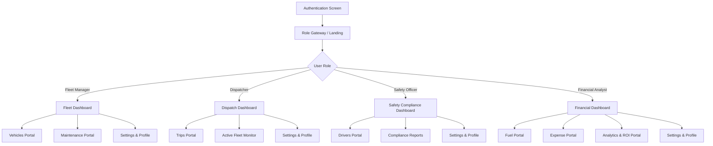

# TransitOps Information Architecture (IA)

This document establishes the structural organization, navigation depth, and content relationships of the TransitOps platform. The architecture is optimized to minimize cognitive load, enforce Role-Based Access Control (RBAC), and limit maximum navigation depth to **three levels**.

---

## 1. Global Navigation Map

---

## 2. Navigation Hierarchy & Depth Limits

TransitOps enforces a **flat hierarchy** (maximum depth of 3 levels from root) to reduce page-switching delays and simplify mental mapping.

### Depth Level Breakdown
*   **Level 0 (Root)**: Authentication Gateway & Session Validation.
*   **Level 1 (Entry)**: Role-Specific Dashboard (The customized landing canvas containing key metrics and primary modules navigation).
*   **Level 2 (Portal)**: Module Index Views (e.g., Vehicles List, Trips Table, Expenses log). Includes search and filters.
*   **Level 3 (Detail/Action)**: Entity Detail Views (e.g., specific Vehicle lifecycle history) or contextual modals (e.g., Create Trip form).

---

## 3. Role-Based Access Mapping (RBAC Directory)

This table defines the structural directories visible and interactive for each user role:

| Directory Portal | Level 1: Dashboard | Level 2: Portal Index | Level 3: Detail / Action | Access Group |
| :--- | :--- | :--- | :--- | :--- |
| **Authentication** | Sign-In Screen | n/a | Password Recovery Modal | All Users |
| **Vehicles** | Fleet Health Stats | Vehicles Directory | Vehicle Profile, Register Vehicle | Fleet Manager |
| **Drivers** | Safety Compliance Stats | Drivers Directory | Driver Profile, Register Driver | Safety Officer |
| **Trips** | Daily Dispatch stats | Trips Log | Trip Detail Page, Create Trip Form | Dispatcher, Driver (own trips) |
| **Maintenance** | Pending Servicing Stats | Maintenance Logs | Record Maintenance Log | Fleet Manager |
| **Fuel Logs** | Fuel Efficiency Stats | Fuel Logs Directory | Add Fuel Expense Entry | Financial Analyst |
| **Expenses** | Operational Cost stats | Expense Logs Directory | Log Expense Entry | Financial Analyst |
| **Analytics** | Financial Dashboard | Reports Index | ROI & Fleet Utilization Charts | Financial Analyst |
| **Settings** | Configuration Portal | Profile Settings | Security & Preferences | All Users |

---

## 4. Hierarchy Structure by Role

### A. Fleet Manager Hierarchy
1.  **Dashboard (Level 1)**: Fleet Health, Active Maintenance, Vehicle Availability.
    *   **Vehicles Portal (Level 2)**: All Registered Vehicles list.
        *   *Register Vehicle (Level 3)*: Validation & Input form.
        *   *Vehicle Profile (Level 3)*: History logs, ROI breakdown.
    *   **Maintenance Portal (Level 2)**: Active Shop Tickets list.
        *   *Log Maintenance Ticket (Level 3)*: Status adjustment form.
        *   *Maintenance Ticket Detail (Level 3)*: Maintenance details.

### B. Dispatcher Hierarchy
1.  **Dashboard (Level 1)**: Today's Trips, Available Driver Count, Pending Dispatches.
    *   **Trips Portal (Level 2)**: Logs of Draft, Dispatched, Completed, and Cancelled trips.
        *   *Create Trip (Level 3)*: Weight and driver availability validation wizard.
        *   *Trip Monitor (Level 3)*: Interactive timeline and route detail logs.

### C. Safety Officer Hierarchy
1.  **Dashboard (Level 1)**: Compliance status, suspended driver counter, expired license flags.
    *   **Drivers Portal (Level 2)**: Comprehensive driver roster.
        *   *Register Driver (Level 3)*: License expiration data verification input.
        *   *Driver Performance (Level 3)*: Safety scores, suspension logs.

### D. Financial Analyst Hierarchy
1.  **Dashboard (Level 1)**: Fuel margins, overall operational costs, revenue trends.
    *   **Expenses & Fuel Log (Level 2)**: Unified list of all logged transactions.
        *   *Log Expense (Level 3)*: Invoice validation input.
    *   **Analytics Portal (Level 2)**: Interactive charts (ROI, Fuel trends).
        *   *Export Data (Level 3)*: CSV parameters exporter.

---

## 5. Information Structure & Relationship Map

*   **Vehicle Entity**: Possesses a one-to-many relationship with both **Trips**, **Maintenance Log Entries**, and **Fuel/Expense Logs**.
*   **Driver Entity**: Bound to a one-to-many relationship with **Trips**.
*   **Trip Entity**: Links a single **Vehicle** to a single **Driver**, generating **Expenses** and **Fuel Logs**.
*   **Settings System**: A universal level 2 portal mapped across all users, configuring personal details, auth keys, and UI theme adjustments.
