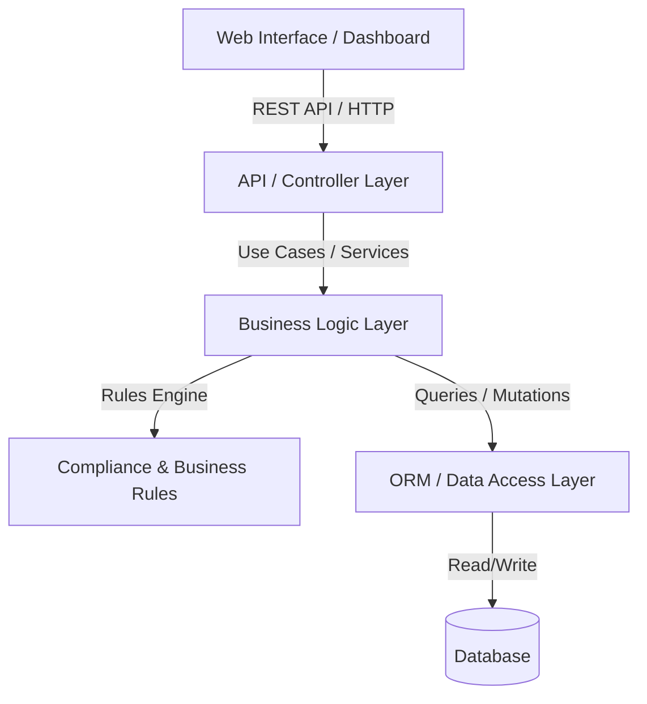
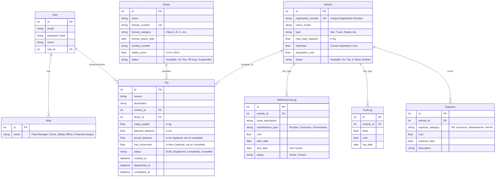
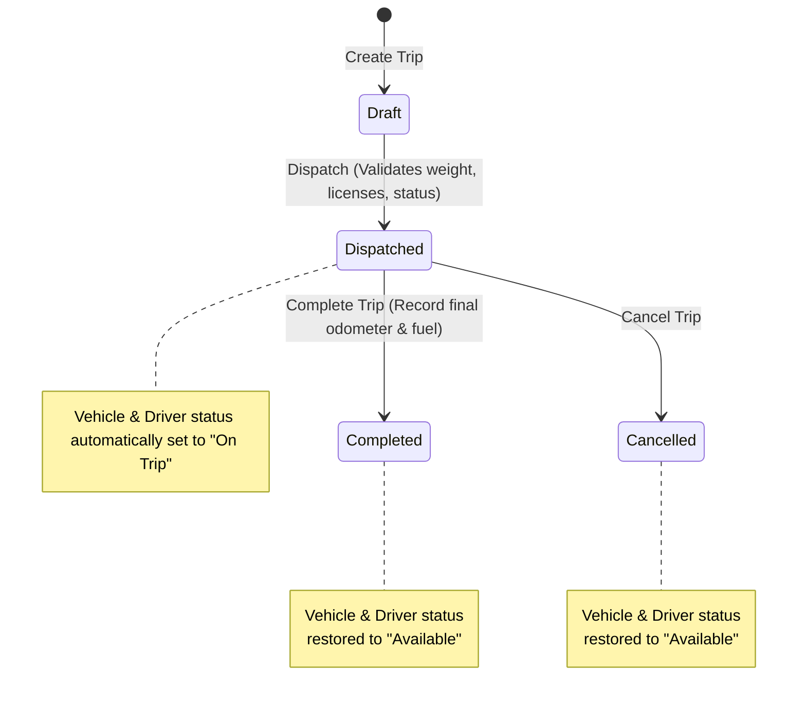
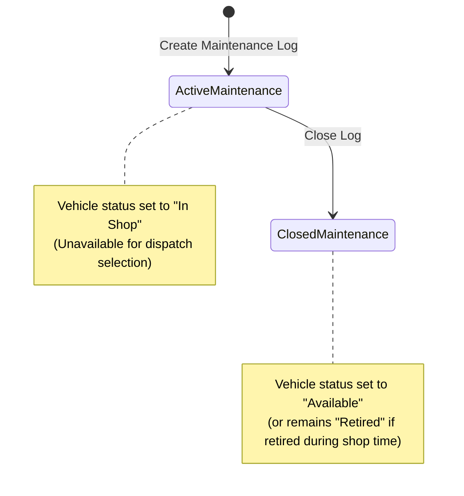

# TransitOps: System Architecture & Business Logic

This document describes the core architecture, data models, state transitions, and business logic rules of the **TransitOps Smart Transport Operations Platform**.

---

## 1. System Architecture Diagram

---

## 2. Database Schema (Entities & Relationships)

The database consists of 8 core entities. Below is the Entity-Relationship Diagram (ERD) defining their associations.

---

## 3. Core Business Rules

The following mandatory rules are enforced at the service level and database constraint layer:

1. **Unique Registration**: The vehicle `registration_number` and driver `license_number` must be unique.
2. **Dispatch Availability**:
   - Vehicles marked as `Retired` or `In Shop` are excluded from the dispatch selection pool.
   - Drivers with an expired license (current date > `license_expiry_date`) or marked as `Suspended` are excluded from dispatch.
3. **Double-Booking Prevention**:
   - A driver or vehicle with the status `On Trip` cannot be assigned to another trip.
4. **Capacity Enforcement**:
   - The cargo weight of a trip must not exceed the selected vehicle's `max_load_capacity` ($CargoWeight \le MaxLoadCapacity$).

---

## 4. State Transition Workflows

### Trip Lifecycle Status Transitions
The trip status lifecycle dictates the status changes of both the associated `Vehicle` and `Driver`.

### Maintenance Workflows
Creating a maintenance record automatically overrides the vehicle's availability.

---

## 5. Calculations and KPI Formulas

### 1. Fleet Utilization (%)
$$\text{Fleet Utilization (\%)} = \left( \frac{\text{Number of Vehicles marked 'On Trip'}}{\text{Total Registered Vehicles - Retired Vehicles}} \right) \times 100$$

### 2. Fuel Efficiency (km/L)
$$\text{Fuel Efficiency} = \frac{\text{Total Distance Travelled (km)}}{\text{Total Fuel Consumed (L)}}$$

### 3. Total Operational Cost per Vehicle ($)
$$\text{Total Operational Cost} = \sum(\text{Fuel Log Cost}) + \sum(\text{Maintenance Log Cost}) + \sum(\text{Other Expense Costs})$$

### 4. Vehicle Return on Investment (ROI)
$$\text{Vehicle ROI} = \frac{\text{Revenue generated by Vehicle} - \text{Total Operational Cost}}{\text{Acquisition Cost}}$$
*Note: Revenue can be calculated based on a fixed rate per km or contract value per completed trip.*
