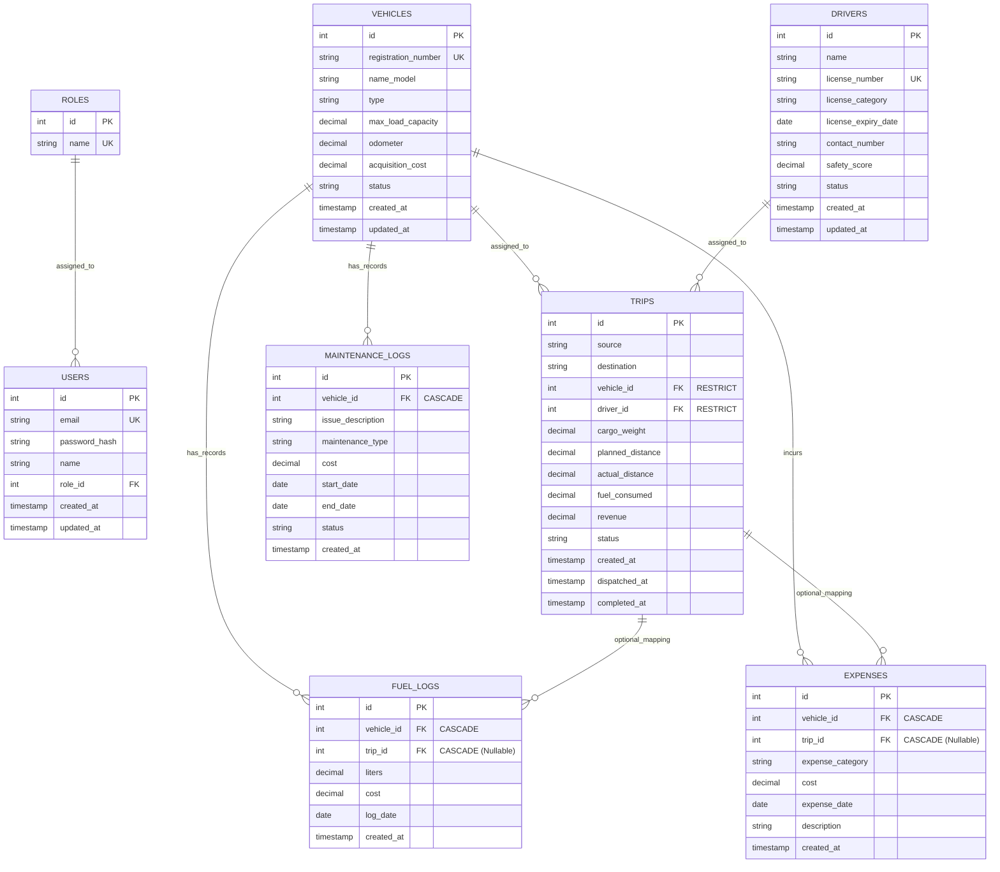

# TransitOps: Database Model Schema & Relationships

This document contains the complete database model schema specification for the **TransitOps Platform**. It includes detailed entity descriptions, primary/foreign keys, datatypes, indexing strategies, constraints, referential integrity policies, and a code representation in both **Prisma Schema (ORM)** and **Raw PostgreSQL DDL**.

---

## 1. Entity Relationship Diagram (ERD)



---

## 2. Table Schemas in Detail

### 2.1 `roles`
Stores access levels for Role-Based Access Control.
* **id**: `INT`, Primary Key, Auto-Increment.
* **name**: `VARCHAR(50)`, Unique, Not Null. Supported values: `Fleet Manager`, `Driver`, `Safety Officer`, `Financial Analyst`.

### 2.2 `users`
Contains credentials and account details.
* **id**: `INT`, Primary Key, Auto-Increment.
* **email**: `VARCHAR(255)`, Unique, Not Null.
* **password_hash**: `VARCHAR(255)`, Not Null.
* **name**: `VARCHAR(100)`, Not Null.
* **role_id**: `INT`, Foreign Key references `roles(id)`. Action on Role delete: `RESTRICT`.
* **created_at / updated_at**: `TIMESTAMP`, default `NOW()`.

### 2.3 `vehicles`
Stores fleet assets.
* **id**: `INT`, Primary Key, Auto-Increment.
* **registration_number**: `VARCHAR(50)`, Unique, Not Null. (Indexed).
* **name_model**: `VARCHAR(100)`, Not Null.
* **type**: `VARCHAR(50)`, Not Null (e.g., `Van`, `Heavy Truck`, `Light Truck`).
* **max_load_capacity**: `DECIMAL(10, 2)`, Not Null. Represented in kg.
* **odometer**: `DECIMAL(12, 2)`, Not Null. Represented in km.
* **acquisition_cost**: `DECIMAL(12, 2)`, Not Null.
* **status**: `VARCHAR(20)`, Default `Available`. Check Constraint: `status IN ('Available', 'On Trip', 'In Shop', 'Retired')`. (Indexed).

### 2.4 `drivers`
Onboarded operators and compliance indicators.
* **id**: `INT`, Primary Key, Auto-Increment.
* **name**: `VARCHAR(100)`, Not Null.
* **license_number**: `VARCHAR(100)`, Unique, Not Null.
* **license_category**: `VARCHAR(50)`, Not Null.
* **license_expiry_date**: `DATE`, Not Null. (Indexed).
* **contact_number**: `VARCHAR(30)`, Not Null.
* **safety_score**: `DECIMAL(5, 2)`, Default `100.00`.
* **status**: `VARCHAR(20)`, Default `Available`. Check Constraint: `status IN ('Available', 'On Trip', 'Off Duty', 'Suspended')`. (Indexed).

### 2.5 `trips`
Central ledger for deliveries and state updates.
* **id**: `INT`, Primary Key, Auto-Increment.
* **source / destination**: `VARCHAR(255)`, Not Null.
* **vehicle_id**: `INT`, Foreign Key references `vehicles(id)`. Delete policy: `RESTRICT` (Prevents orphan analytics stats).
* **driver_id**: `INT`, Foreign Key references `drivers(id)`. Delete policy: `RESTRICT`.
* **cargo_weight**: `DECIMAL(10, 2)`, Not Null.
* **planned_distance**: `DECIMAL(10, 2)`, Not Null.
* **actual_distance**: `DECIMAL(10, 2)`, Nullable (Captured upon trip completion).
* **fuel_consumed**: `DECIMAL(10, 2)`, Nullable.
* **revenue**: `DECIMAL(12, 2)`, Default `0.00`.
* **status**: `VARCHAR(20)`, Default `Draft`. Check Constraint: `status IN ('Draft', 'Dispatched', 'Completed', 'Cancelled')`. (Indexed).
* **timestamps**: `created_at`, `dispatched_at` (Nullable), `completed_at` (Nullable).

### 2.6 `maintenance_logs`
Repair histories and operational holds.
* **id**: `INT`, Primary Key, Auto-Increment.
* **vehicle_id**: `INT`, Foreign Key references `vehicles(id)`. Delete policy: `CASCADE` (Removes maintenance details if vehicle is fully deleted).
* **issue_description**: `TEXT`, Not Null.
* **maintenance_type**: `VARCHAR(50)`, Not Null. Check Constraint: `maintenance_type IN ('Routine', 'Corrective', 'Preventative')`.
* **cost**: `DECIMAL(12, 2)`, Default `0.00`.
* **start_date**: `DATE`, Not Null.
* **end_date**: `DATE`, Nullable.
* **status**: `VARCHAR(20)`, Default `Active`. Check Constraint: `status IN ('Active', 'Closed')`.

### 2.7 `fuel_logs`
* **id**: `INT`, Primary Key, Auto-Increment.
* **vehicle_id**: `INT`, Foreign Key references `vehicles(id)`. Delete policy: `CASCADE`.
* **trip_id**: `INT`, Nullable. Foreign Key references `trips(id)`. Delete policy: `CASCADE`.
* **liters**: `DECIMAL(10, 2)`, Not Null.
* **cost**: `DECIMAL(10, 2)`, Not Null.
* **log_date**: `DATE`, Not Null.

### 2.8 `expenses`
Logbook for fees incurred outside standard maintenance.
* **id**: `INT`, Primary Key, Auto-Increment.
* **vehicle_id**: `INT`, Foreign Key references `vehicles(id)`. Delete policy: `CASCADE`.
* **trip_id**: `INT`, Nullable, Foreign Key references `trips(id)`. Delete policy: `CASCADE`.
* **expense_category**: `VARCHAR(50)`, Not Null. Check Constraint: `expense_category IN ('Toll', 'Permit', 'Insurance', 'Other')`.
* **cost**: `DECIMAL(10, 2)`, Not Null.
* **expense_date**: `DATE`, Not Null.
* **description**: `TEXT`, Nullable.

---

## 3. Prisma Schema Code (`schema.prisma`)

```prisma
datasource db {
  provider = "postgresql"
  url      = env("DATABASE_URL")
}

generator client {
  provider = "prisma-client-js"
}

model Role {
  id    Int    @id @default(autoincrement())
  name  String @unique
  users User[]

  @@map("roles")
}

model User {
  id           Int      @id @default(autoincrement())
  email        String   @unique
  passwordHash String   @map("password_hash")
  name         String
  roleId       Int      @map("role_id")
  role         Role     @relation(fields: [roleId], references: [id], onDelete: Restrict)
  createdAt    DateTime @default(now()) @map("created_at")
  updatedAt    DateTime @updatedAt @map("updated_at")

  @@map("users")
}

model Vehicle {
  id                 Int              @id @default(autoincrement())
  registrationNumber String           @unique @map("registration_number")
  nameModel          String           @map("name_model")
  type               String
  maxLoadCapacity    Decimal          @map("max_load_capacity") @db.Decimal(10, 2)
  odometer           Decimal          @db.Decimal(12, 2)
  acquisitionCost    Decimal          @map("acquisition_cost") @db.Decimal(12, 2)
  status             String           @default("Available")
  trips              Trip[]
  maintenanceLogs    MaintenanceLog[]
  fuelLogs           FuelLog[]
  expenses           Expense[]
  createdAt          DateTime         @default(now()) @map("created_at")
  updatedAt          DateTime         @updatedAt @map("updated_at")

  @@index([status])
  @@map("vehicles")
}

model Driver {
  id                 Int      @id @default(autoincrement())
  name               String
  licenseNumber      String   @unique @map("license_number")
  licenseCategory    String   @map("license_category")
  licenseExpiryDate  DateTime @map("license_expiry_date") @db.Date
  contactNumber      String   @map("contact_number")
  safetyScore        Decimal  @default(100.00) @map("safety_score") @db.Decimal(5, 2)
  status             String   @default("Available")
  trips              Trip[]
  createdAt          DateTime @default(now()) @map("created_at")
  updatedAt          DateTime @updatedAt @map("updated_at")

  @@index([status])
  @@index([licenseExpiryDate])
  @@map("drivers")
}

model Trip {
  id              Int       @id @default(autoincrement())
  source          String
  destination     String
  vehicleId       Int       @map("vehicle_id")
  vehicle         Vehicle   @relation(fields: [vehicleId], references: [id], onDelete: Restrict)
  driverId        Int       @map("driver_id")
  driver          Driver    @relation(fields: [driverId], references: [id], onDelete: Restrict)
  cargoWeight     Decimal   @map("cargo_weight") @db.Decimal(10, 2)
  plannedDistance Decimal   @map("planned_distance") @db.Decimal(10, 2)
  actualDistance  Decimal?  @map("actual_distance") @db.Decimal(10, 2)
  fuelConsumed    Decimal?  @map("fuel_consumed") @db.Decimal(10, 2)
  revenue         Decimal   @default(0.00) @db.Decimal(12, 2)
  status          String    @default("Draft")
  fuelLogs        FuelLog[]
  expenses        Expense[]
  createdAt       DateTime  @default(now()) @map("created_at")
  dispatchedAt    DateTime? @map("dispatched_at")
  completedAt     DateTime? @map("completed_at")

  @@index([status])
  @@map("trips")
}

model MaintenanceLog {
  id               Int       @id @default(autoincrement())
  vehicleId        Int       @map("vehicle_id")
  vehicle          Vehicle   @relation(fields: [vehicleId], references: [id], onDelete: Cascade)
  issueDescription String    @map("issue_description") @db.Text
  maintenanceType  String    @map("maintenance_type")
  cost             Decimal   @default(0.00) @db.Decimal(12, 2)
  startDate        DateTime  @map("start_date") @db.Date
  endDate          DateTime? @map("end_date") @db.Date
  status           String    @default("Active")
  createdAt        DateTime  @default(now()) @map("created_at")

  @@map("maintenance_logs")
}

model FuelLog {
  id        Int      @id @default(autoincrement())
  vehicleId Int      @map("vehicle_id")
  vehicle   Vehicle  @relation(fields: [vehicleId], references: [id], onDelete: Cascade)
  tripId    Int?     @map("trip_id")
  trip      Trip?    @relation(fields: [tripId], references: [id], onDelete: Cascade)
  liters    Decimal  @db.Decimal(10, 2)
  cost      Decimal  @db.Decimal(10, 2)
  logDate   DateTime @map("log_date") @db.Date
  createdAt DateTime @default(now()) @map("created_at")

  @@map("fuel_logs")
}

model Expense {
  id              Int      @id @default(autoincrement())
  vehicleId       Int      @map("vehicle_id")
  vehicle         Vehicle  @relation(fields: [vehicleId], references: [id], onDelete: Cascade)
  tripId          Int?     @map("trip_id")
  trip            Trip?    @relation(fields: [tripId], references: [id], onDelete: Cascade)
  expenseCategory String   @map("expense_category")
  cost            Decimal  @db.Decimal(10, 2)
  expenseDate     DateTime @map("expense_date") @db.Date
  description     String?  @db.Text
  createdAt       DateTime @default(now()) @map("created_at")

  @@map("expenses")
}
```

---

## 4. PostgreSQL raw DDL scripts

```sql
-- Create Roles
CREATE TABLE roles (
    id SERIAL PRIMARY KEY,
    name VARCHAR(50) UNIQUE NOT NULL
);

-- Create Users
CREATE TABLE users (
    id SERIAL PRIMARY KEY,
    email VARCHAR(255) UNIQUE NOT NULL,
    password_hash VARCHAR(255) NOT NULL,
    name VARCHAR(100) NOT NULL,
    role_id INT NOT NULL REFERENCES roles(id) ON DELETE RESTRICT,
    created_at TIMESTAMP DEFAULT CURRENT_TIMESTAMP,
    updated_at TIMESTAMP DEFAULT CURRENT_TIMESTAMP
);

-- Create Vehicles
CREATE TABLE vehicles (
    id SERIAL PRIMARY KEY,
    registration_number VARCHAR(50) UNIQUE NOT NULL,
    name_model VARCHAR(100) NOT NULL,
    type VARCHAR(50) NOT NULL,
    max_load_capacity DECIMAL(10, 2) NOT NULL,
    odometer DECIMAL(12, 2) NOT NULL,
    acquisition_cost DECIMAL(12, 2) NOT NULL,
    status VARCHAR(20) DEFAULT 'Available' CHECK (status IN ('Available', 'On Trip', 'In Shop', 'Retired')),
    created_at TIMESTAMP DEFAULT CURRENT_TIMESTAMP,
    updated_at TIMESTAMP DEFAULT CURRENT_TIMESTAMP
);
CREATE INDEX idx_vehicles_status ON vehicles(status);

-- Create Drivers
CREATE TABLE drivers (
    id SERIAL PRIMARY KEY,
    name VARCHAR(100) NOT NULL,
    license_number VARCHAR(100) UNIQUE NOT NULL,
    license_category VARCHAR(50) NOT NULL,
    license_expiry_date DATE NOT NULL,
    contact_number VARCHAR(30) NOT NULL,
    safety_score DECIMAL(5, 2) DEFAULT 100.00,
    status VARCHAR(20) DEFAULT 'Available' CHECK (status IN ('Available', 'On Trip', 'Off Duty', 'Suspended')),
    created_at TIMESTAMP DEFAULT CURRENT_TIMESTAMP,
    updated_at TIMESTAMP DEFAULT CURRENT_TIMESTAMP
);
CREATE INDEX idx_drivers_status ON drivers(status);
CREATE INDEX idx_drivers_expiry ON drivers(license_expiry_date);

-- Create Trips
CREATE TABLE trips (
    id SERIAL PRIMARY KEY,
    source VARCHAR(255) NOT NULL,
    destination VARCHAR(255) NOT NULL,
    vehicle_id INT NOT NULL REFERENCES vehicles(id) ON DELETE RESTRICT,
    driver_id INT NOT NULL REFERENCES drivers(id) ON DELETE RESTRICT,
    cargo_weight DECIMAL(10, 2) NOT NULL,
    planned_distance DECIMAL(10, 2) NOT NULL,
    actual_distance DECIMAL(10, 2),
    fuel_consumed DECIMAL(10, 2),
    revenue DECIMAL(12, 2) DEFAULT 0.00,
    status VARCHAR(20) DEFAULT 'Draft' CHECK (status IN ('Draft', 'Dispatched', 'Completed', 'Cancelled')),
    created_at TIMESTAMP DEFAULT CURRENT_TIMESTAMP,
    dispatched_at TIMESTAMP,
    completed_at TIMESTAMP
);
CREATE INDEX idx_trips_status ON trips(status);

-- Create Maintenance Logs
CREATE TABLE maintenance_logs (
    id SERIAL PRIMARY KEY,
    vehicle_id INT NOT NULL REFERENCES vehicles(id) ON DELETE CASCADE,
    issue_description TEXT NOT NULL,
    maintenance_type VARCHAR(50) NOT NULL CHECK (maintenance_type IN ('Routine', 'Corrective', 'Preventative')),
    cost DECIMAL(12, 2) DEFAULT 0.00,
    start_date DATE NOT NULL,
    end_date DATE,
    status VARCHAR(20) DEFAULT 'Active' CHECK (status IN ('Active', 'Closed')),
    created_at TIMESTAMP DEFAULT CURRENT_TIMESTAMP
);

-- Create Fuel Logs
CREATE TABLE fuel_logs (
    id SERIAL PRIMARY KEY,
    vehicle_id INT NOT NULL REFERENCES vehicles(id) ON DELETE CASCADE,
    trip_id INT REFERENCES trips(id) ON DELETE CASCADE,
    liters DECIMAL(10, 2) NOT NULL,
    cost DECIMAL(10, 2) NOT NULL,
    log_date DATE NOT NULL,
    created_at TIMESTAMP DEFAULT CURRENT_TIMESTAMP
);

-- Create Expenses
CREATE TABLE expenses (
    id SERIAL PRIMARY KEY,
    vehicle_id INT NOT NULL REFERENCES vehicles(id) ON DELETE CASCADE,
    trip_id INT REFERENCES trips(id) ON DELETE CASCADE,
    expense_category VARCHAR(50) NOT NULL CHECK (expense_category IN ('Toll', 'Permit', 'Insurance', 'Other')),
    cost DECIMAL(10, 2) NOT NULL,
    expense_date DATE NOT NULL,
    description TEXT,
    created_at TIMESTAMP DEFAULT CURRENT_TIMESTAMP
);
```
