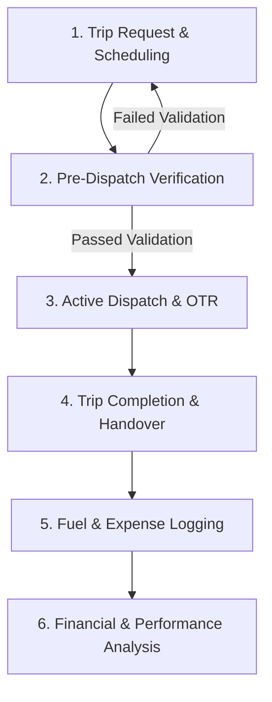
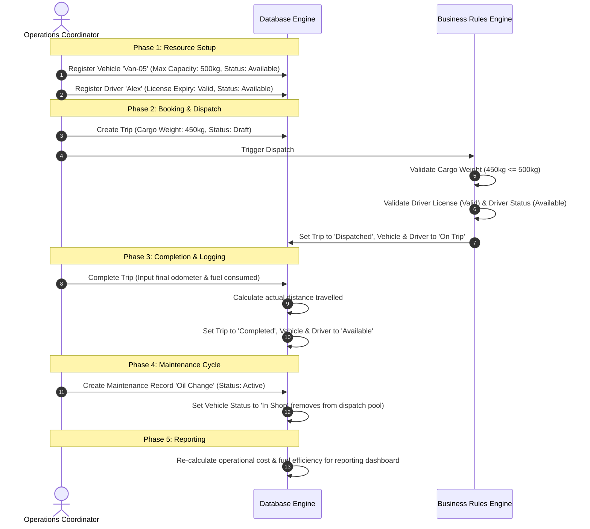
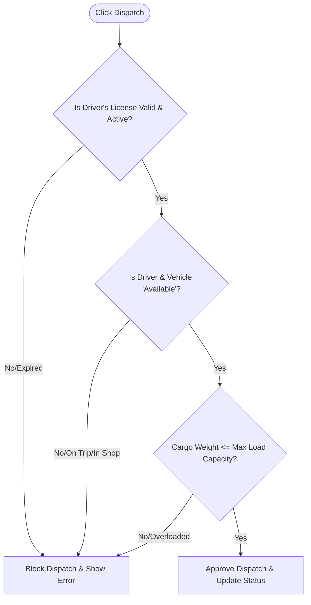

# TransitOps: End-to-End Operational Flow

This document details the complete operational lifecycle of a transport request in the **TransitOps** platform—tracing the path from initial resource requests and safety verifications to vehicle return, fuel logging, and final financial analysis.

---

## Operational Flow Overview

---

## Example Walkthrough Case Study

Below is the concrete step-by-step example workflow demonstrating the complete software state lifecycle, from database initialization to financial updates:

### Detailed Breakdown of Example Workflow Steps

#### Step 1: Register Vehicle `Van-05`
* **Action**: Create a new record in the `Vehicle` table.
* **Payload**: `registration_number: "Van-05"`, `max_load_capacity: 500` (kg), `odometer: 10000` (km), `status: "Available"`.
* **State**: Vehicle is now eligible for selection in the dispatch screen.

#### Step 2: Register Driver `Alex`
* **Action**: Create a new record in the `Driver` table.
* **Payload**: `name: "Alex"`, `license_expiry_date: "2028-12-31"`, `status: "Available"`.
* **State**: Driver is registered and active.

#### Step 3: Create Trip Draft
* **Action**: Create a record in the `Trip` table.
* **Payload**: `vehicle_id: Van-05`, `driver_id: Alex`, `cargo_weight: 450` (kg), `status: "Draft"`.

#### Step 4: System Validations
* **Action**: Run `validations.ts` on trigger dispatch.
* **Evaluation**: $450\text{ kg (Cargo Weight)} \le 500\text{ kg (Vehicle Capacity)}$. Checks license validation date ($2026-07-12 \le 2028-12-31$).
* **Result**: Validation succeeds; allow transition.

#### Step 5: Automatic Status Shifts on Dispatch
* **Action**: Commit database updates.
* **Result**: `Trip.status` becomes `Dispatched`. Both `Van-05` status and `Alex` status automatically transition to `On Trip`.

#### Step 6: Complete the Trip
* **Action**: Record final trip data.
* **Payload**: `final_odometer: 10150` (km), `fuel_consumed: 12` (Liters).
* **Evaluation**: Calculated distance is $10150 - 10000 = 150$ km.

#### Step 7: Automatic Status Shifts on Completion
* **Action**: Commit database updates.
* **Result**: `Trip.status` becomes `Completed`. Vehicle `Van-05`'s odometer is updated to `10150`. Both `Van-05` status and `Alex` status transition back to `Available`.

#### Step 8: Trigger Maintenance record
* **Action**: Create a new record in the `MaintenanceLog` table.
* **Payload**: `vehicle_id: Van-05`, `description: "Routine Oil Change"`, `status: "Active"`.
* **Result**: Vehicle `Van-05`'s status automatically transitions to `In Shop`. It is immediately removed from the selection pool for dispatching new trips.

#### Step 9: Report & Dashboard Updates
* **Action**: Query reports engine.
* **Calculated Values**:
  * **Operational Cost**: Incorporates the cost of the fuel from Step 6 + maintenance cost from Step 8.
  * **Fuel Efficiency**: Updated using the new trip stats: $\frac{150\text{ km}}{12\text{ Liters}} = 12.5\text{ km/L}$.

---

## Step 1: Trip Request & Scheduling (Draft State)

The workflow begins when a logistics coordinator or client submits a request for a cargo shipment.

1. **Intake of Parameters**: The Dispatcher inputs the core requirements:
   - Source & Destination
   - Cargo Weight (kg)
   - Planned Distance (km)
2. **Resource Match Suggestions**:
   - The system queries database records to suggest **Available** drivers and vehicles.
   - *Database Filter*: Excludes any driver or vehicle with a status of `On Trip`, `Suspended`, `Off Duty`, `Retired`, or `In Shop`.
3. **Creation of Draft**:
   - The trip is saved with the status of `Draft`.
   - At this stage, no database status changes occur for the vehicle or driver.

---

## Step 2: Pre-Dispatch Compliance Verification

Before a trip can transition to the active state, the system runs an automated validation sequence.

### The Verification Checkpoint
When the operator clicks **Dispatch**, the system executes the following checks:
1. **Driver License Expiry Validation**:
   $$\text{Current Date} \le \text{Driver.license\_expiry\_date}$$
   If the license is expired, the system throws: `Validation Error: Driver license has expired.`
2. **Driver Status Audit**: 
   Ensures the driver's status is exactly `Available`. If the status is `Suspended` or `On Trip`, the dispatch is rejected.
3. **Vehicle Status Audit**:
   Ensures the vehicle status is exactly `Available`. If `In Shop` (active maintenance) or `Retired`, the dispatch is blocked.
4. **Cargo Capacity Check**:
   $$\text{Trip.cargo\_weight} \le \text{Vehicle.max\_load\_capacity}$$
   If overloaded, the system throws: `Validation Error: Cargo weight exceeds maximum load capacity for this vehicle.`

---

## Step 3: Active Dispatch (On Trip State)

Once all checks clear successfully, the trip moves into execution:

1. **Transaction Lock**:
   All status updates run inside an atomic database transaction to prevent double-booking:
   - `Trip.status` updates to `Dispatched`.
   - `Vehicle.status` updates to `On Trip`.
   - `Driver.status` updates to `On Trip`.
2. **On-the-Road (OTR)**:
   The vehicle and driver are now locked out of any other scheduling queries or dropdown fields across the platform.

---

## Step 4: Trip Completion & Handover (Vehicle Return)

When the driver arrives at the final destination and completes the delivery:

1. **Physical Inspection & Odometer Read**:
   - The driver reports the **Final Odometer** reading from the dashboard.
   - The driver logs the **Fuel Consumed** (in liters) for that specific journey.
2. **Closing the Loop (Database Transaction)**:
   - The operator updates the trip to `Completed`.
   - `Trip.actual_distance` is calculated:
     $$\text{Actual Distance} = \text{Final Odometer} - \text{Initial Vehicle Odometer}$$
   - The associated `Vehicle.odometer` is updated to the `Final Odometer` value.
   - `Vehicle.status` returns to `Available`.
   - `Driver.status` returns to `Available`.

---

## Step 5: Fuel & Expense Logging

Upon completion, all costs accrued during the trip are permanently logged against the vehicle:

1. **Fuel Logging**:
   - Liters consumed and cost of fuel are saved into the `FuelLog` table.
   - This associates the fuel transaction directly with the `Vehicle` and the `Trip`.
2. **Auxiliary Expenses**:
   - Any additional costs incurred during the journey (e.g., highway tolls, parking permits, unexpected minor repairs) are recorded in the `Expense` table.
3. **Maintenance Logs (If applicable)**:
   - If the driver reports an issue during inspection (e.g., "brakes squeaking"), a `MaintenanceLog` is generated.
   - This instantly shifts the vehicle status from `Available` to `In Shop`, rendering it unavailable for the next route request until resolved.

---

## Step 6: Complete Financial Analysis

The Financial Analyst reviews the aggregated data on the `/reports` dashboard. The system compiles the logs to run three core financial calculations per vehicle:

### 1. Operating Expenses (OpEx)
Accumulates all operational costs over a given timeframe (monthly/yearly):
$$\text{Total Operational Cost} = \sum(\text{Fuel Log Cost}) + \sum(\text{Maintenance Log Cost}) + \sum(\text{Auxiliary Expenses})$$

### 2. Fleet Efficiency (km/L)
Determines fuel economy profiles to optimize route layouts and vehicle replacements:
$$\text{Fuel Efficiency} = \frac{\text{Total Actual Distance Travelled (km)}}{\text{Total Liters of Fuel Consumed}}$$

### 3. Return on Investment (ROI)
Measures the capital efficiency of each asset in the fleet:
$$\text{Vehicle ROI} = \frac{\text{Generated Revenue} - \text{Total Operational Cost}}{\text{Acquisition Cost}} \times 100$$

*The financial team uses these metrics to determine which vehicle classes (Vans vs. Trucks) yield the highest margin, and when a high-maintenance vehicle should be retired.*
